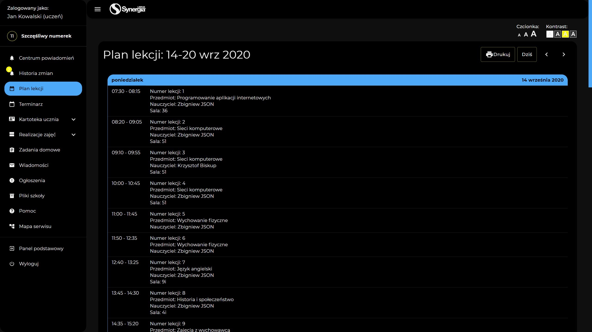

# 🦅 Awesome Librus

Librus on steroids 💪🏼

## Download

[Download zip](https://github.com/kcpru/awesome-librus/raw/master/zip/awesome-librus.zip)

## 🔌 Installation

```
git clone git@github.com:kcpru/awesome-librus
npm i
```

## 🚀 Usage

### Development

```bash
npm start
```

You can view the deploy in `dist`.

### Production build

```bash
npm run build
```


You can view the deploy in `zip`.

### Instructions

- Launch the Chrome browser.
- Navigate to [chrome://extensions/](chrome://extensions/).
- Click the "Load unpacked extension..." button on the top left of the screen.
- Choose the folder `awesome-librus\dist` and click OK.
- Whenever you make a change to the extension, run `npm run build`, then go back to this page and click the "reload" button on this extension.
- (optionally) You can add [Extensions Reloader](https://chrome.google.com/webstore/detail/extensions-reloader/fimgfedafeadlieiabdeeaodndnlbhid?hl=en) to make development faster

## 💫 Features

- Themes
- Refreshed look
- Automatic redirection to the selected page after logging in



## 👤 Author

- [Kacper Ślusarczyk](https://github.com/kcpru)

## 🧾 License

Yes.
